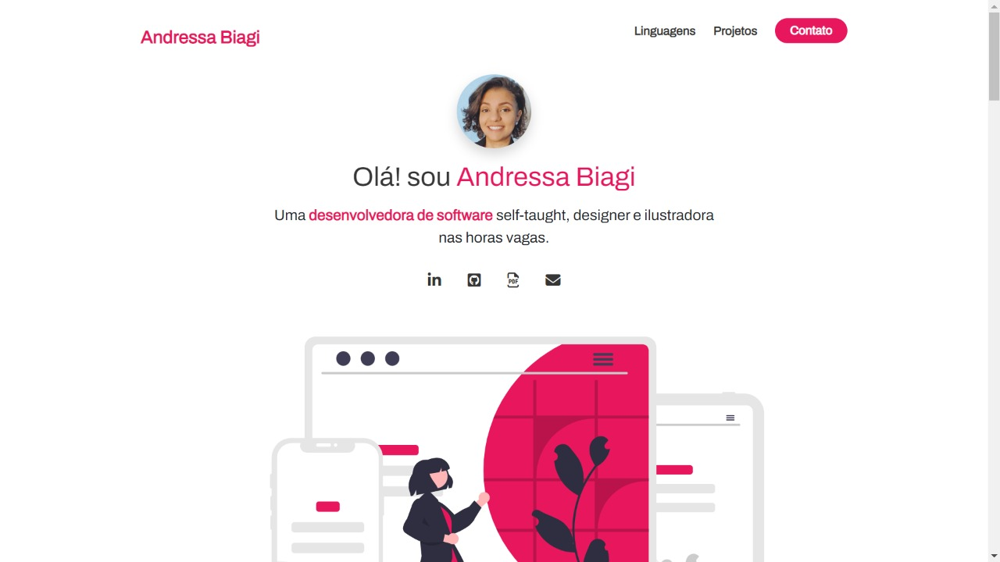
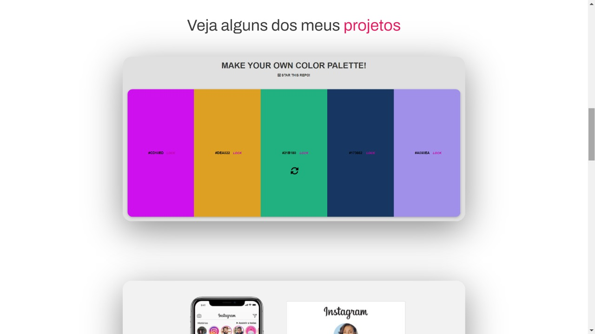
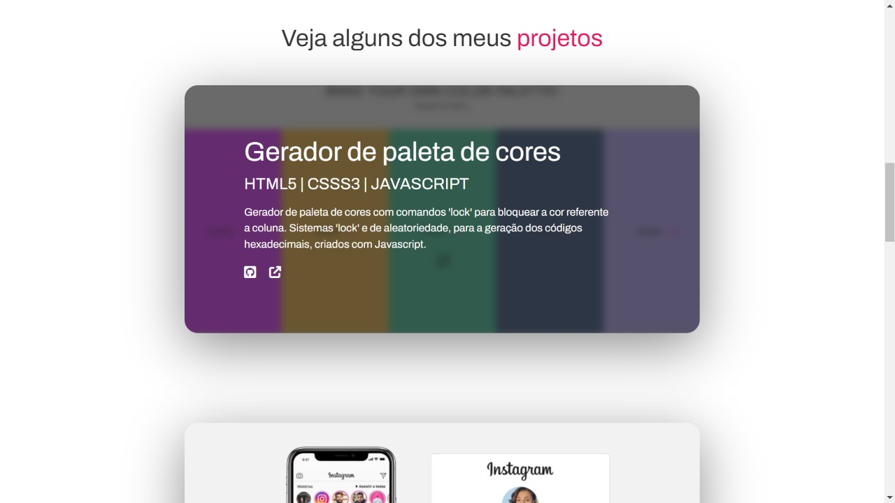

# Portfolio Website

### Website feito para expor minha tragetória como desenvolvedora web até o momento.

- Os conceitos de layout Flexbox foi muito bem usado para conseguir alcançar uma responsividade satisfatória;
 

 - Animações e Keyframes foram usados no inicio da página para gerar mais fluidez no 'refresh' da página.

 
 - Efeitos com os selectors :hover e :after também foram implementados para que houvesse essa transição quando o recrutador passar o mouse na imagem.

 
 
 ## Visite atráves do link:

andressabiagi.github.io/AndressaBiagiDevE-portfolio

